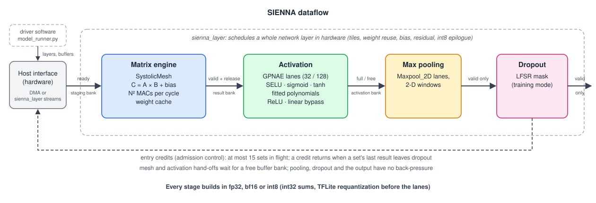

# SIENNA

**A neural-network inference accelerator in SystemVerilog that runs real TensorFlow Lite models in fp32, bf16 and int8.**

SIENNA multiplies matrices on a streaming systolic mesh, applies SELU, sigmoid or tanh on a bank of polynomial activation lanes, then pools and applies dropout. Every stage works on a different set of data at the same time. A Python host stack lowers TFLite models onto it, so a whole ResNet-8 inference runs on the hardware in simulation.

| | |
|---|---|
| **1.73 TFLOPS** sustained | 32 × 32 mesh streaming fp32 matrix multiplies at 89% of peak (1.71 TOPS in int8) |
| **54 µs** per ResNet-8 inference | CIFAR-10 image, every multiply-accumulate on the RTL, 95% of the mesh busy |
| **0 of 198 656** outputs differ | int8 layers against the TensorFlow Lite interpreter, bit for bit |
| **35× fewer cycles** per activation | than the published TYTAN engine it grew from (747 → 21 cycles for tanh) |
| **up to 16× faster** on small layers | by packing many small matrix multiplies into one |

Times assume a 950 MHz clock ([why](#performance)).

---

## Architecture



What makes it fast, stage by stage:

- **Matrix engine** ([SystolicMesh](https://github.com/SoHam-56/SystolicMesh)). Each small systolic array owns one output tile and runs the full depth, so every array finishes at the same time. Double-buffered inputs, partial-sum banks in every PE and four result banks let one set load while the previous one multiplies and the one before is read out. A weight cache keeps reused weights on chip.
- **Activation** ([GPNAE](https://github.com/SoHam-56/GPNAE)). SELU, sigmoid and tanh are fitted polynomials, not an exponential followed by a divider. A barrel multiply-accumulate unit interleaves inputs so it never waits on its own pipeline. 32 lanes fill in parallel from one wide read.
- **Pipeline.** A credit scheme keeps up to 15 sets in flight. The host starts a new set the moment a buffer frees up, and each set carries its own activation function.
- **Layer engine.** `sienna_layer` schedules a whole network layer in hardware: tiling, weight reuse, bias, residual adds, depthwise convolution and the int8 epilogue. The host only streams data.
- **Packing.** Layers too small to fill the mesh share one matrix multiply, each in its own diagonal block. The processing elements skip everything outside their block.
- **One design, three formats.** fp32, bf16 and int8 (int32 sums, TensorFlow Lite requantization) build from the same RTL. bf16 and int8 match bit-exact Python models of the hardware, and int8 matches the TensorFlow Lite interpreter.

---

## Performance

> All numbers are measured in cycle-accurate Verilator simulation of the RTL. Times assume a **950 MHz** clock, the frequency the published TYTAN activation engine reached in a 45 nm process ([paper](#publication)). Synthesis of the full SIENNA pipeline is planned.

**How a set is timed.** A set is one N × N by N × N matrix multiply (2N³ operations) followed by its activation, pooling and dropout. The testbench counts cycles from the host's start to the set's completion signal:

| N = 16, fp32, bias + ReLU set | Cycles | Time |
|---|---|---|
| First result (latency) | 100 | 105 ns |
| Each further set while streaming (throughput) | 19 | 20 ns |

### Throughput while streaming sets

GFLOPS (GOPS in int8), 24 sets per run, with the activation applied to every set:

| Activation | N = 16 fp32 | N = 16 bf16 | N = 16 int8 | N = 32 fp32 | N = 32 bf16 | N = 32 int8 |
|---|---|---|---|---|---|---|
| ReLU / linear, no pooling | 410 | 410 | 410 | 1 729 | 1 729 | 1 706 |
| SELU | 36 | 50 | 80 | 111 | 128 | 190 |
| sigmoid | 29 | 39 | 74 | 97 | 134 | 173 |
| tanh | 30 | 41 | 72 | 100 | 118 | 170 |

Peak is 486 GFLOPS at N = 16 and 1.95 TFLOPS at N = 32. With ReLU the pipeline keeps pace with the host. Sets with SELU, sigmoid or tanh are limited by the 32 activation lanes, which are fastest in int8.

### MLPerf Tiny models

N = 16, fp32, every multiply-accumulate on the RTL; the host only reshapes tensors and applies softmax.

| Model | Task | MACs | Latency | Throughput |
|---|---|---|---|---|
| ResNet-8 | image classification (CIFAR-10) | 12.5 M | 54.1 µs | 462 GFLOPS |
| DS-CNN | keyword spotting | 2.6 M | 31.4 µs | 168 GFLOPS |
| MobileNet | visual wake words (96 × 96) | 7.5 M | 102.7 µs | 146 GFLOPS |
| Autoencoder | anomaly detection, 40 slices | 10.6 M | 53.6 µs (1.34 µs per slice) | 394 GFLOPS |

In fp32 the hardware picks the same class as the floating-point model on every classifier and reproduces the anomaly score to five digits. bf16 builds run within 1.1% of these times.

### Packing small layers

The same small jobs, run one at a time and packed into shared sets (N = 32), with identical results:

| Jobs | Format | One at a time | Packed | Speedup |
|---|---|---|---|---|
| 16 jobs of 2 output columns | fp32 | 12.45 µs | 1.36 µs | **9.1×** |
| 16 jobs of 2 output columns | int8 | 8.27 µs | 0.95 µs | **8.7×** |
| 16 jobs of 2 columns, 1 024 rows each | bf16 | 22.6 µs | 1.41 µs | **16×** |

### Compared with other accelerators

**Matrix engine.** Multiply-accumulates per cycle do not depend on the clock, so they compare designs fairly. Most edge accelerators are integer-only; SIENNA runs fp32, bf16 and int8 on one mesh.

| Design | Origin | MACs per cycle | Formats | Peak, as published |
|---|---|---|---|---|
| **SIENNA, N = 32** | this work, RTL | 1 024 | fp32, bf16, int8 | 1.95 TFLOPS at 950 MHz (assumed) |
| **SIENNA, N = 16** | this work, RTL | 256 | fp32, bf16, int8 | 486 GFLOPS at 950 MHz (assumed) |
| Google TPU v1 [1] | industry, 28 nm silicon | 65 536 | int8 (int16 at reduced rate) | 92 TOPS at 700 MHz |
| NVIDIA NVDLA, full configuration [2] | industry, open RTL | 2 048 int8, 1 024 int16 / fp16 | int8, int16, fp16 | not published |
| Arm Ethos-U65 [3] | industry, licensable IP | 256 or 512 | int8, int16 | 0.5–1 TOP/s at 1 GHz |
| Arm Ethos-U55 [3] | industry, licensable IP | 32 to 256 | int8, int16 | 64–512 GOP/s at 1 GHz |
| Gemmini, default [4] | academic, open RTL | 256 | int8 with int32 sums | not published |
| Eyeriss [5] | academic, 65 nm silicon | 168 | 16-bit fixed point | 33.6 GMAC/s at 200 MHz |

[1] Jouppi et al., ISCA 2017, [arXiv:1704.04760](https://arxiv.org/abs/1704.04760) · [2] [nvdla.org](http://nvdla.org/primer.html), [nv_full spec](https://github.com/nvdla/hw/blob/nvdlav1/spec/defs/nv_full.spec) · [3] Arm [Ethos-U55](https://armkeil.blob.core.windows.net/developer/Files/pdf/product-brief/arm-ethos-u55-product-brief.pdf) and [Ethos-U65](https://armkeil.blob.core.windows.net/developer/Files/pdf/arm-ethos-u65-product-brief.pdf) product briefs · [4] Genc et al., DAC 2021, [arXiv:1911.09925](https://arxiv.org/abs/1911.09925) · [5] Chen et al., JSSC 2017, [paper](https://www.rle.mit.edu/eems/wp-content/uploads/2016/11/eyeriss_jssc_2017.pdf)

**MLPerf Tiny.** Latency per inference, set against the MLPerf Tiny v1.4 closed-division results [6]:

| Benchmark | SIENNA, N = 16 | Qualcomm Sensing Hub | Renesas RA8P1 + Arm Ethos-U55 | Asygn NNPA_16x | STM32 Cortex-M7, 280 MHz |
|---|---|---|---|---|---|
| Image classification (ResNet-8) | 54.1 µs | 98.5 µs | 340 µs | 2.69 ms | 41.7 ms |
| Keyword spotting (DS-CNN) | 31.4 µs | 66.5 µs | 108 µs | 567 µs | 11.5 ms |
| Visual wake words (MobileNet) | 102.7 µs | 118 µs | 362 µs | 1.63 ms | 24.4 ms |
| Anomaly detection (autoencoder) | 18.6 µs | 69.0 µs | 132 µs | 57.6 µs | 1.17 ms |

These are not like-for-like:
- **MLPerf Tiny:** the entries are measured on production boards running int8 models, with the whole system in the loop.
- **SIENNA:** the times come from RTL simulation of the accelerator alone, running the fp32 models at an assumed 950 MHz.

Read them as an indication of where the architecture stands.

[6] [MLCommons MLPerf Tiny v1.4 results](https://mlcommons.org/benchmarks/inference-tiny/)

---

## Verification

- `make regression` runs every check below and gives one verdict. It passes in fp32, bf16 and int8.
- The pipeline regression runs up to 41 tests per format (32 in fp32 and bf16, 41 in int8) on 8 × 8 to 32 × 32 meshes at every tile size. Each test streams several sets, and every element of every stage is checked.
- The systolic mesh matches its bit-exact model in all three formats from 8 × 8 to 32 × 32, and at 64 × 64 in fp32.
- The int8 layers match the TensorFlow Lite interpreter bit for bit, including SAME-padded convolutions with per-channel scales and input zero points.
- Assertions on every handshake run in every simulation, and a firing assertion fails the run.

---

## Getting started

You need Verilator 5 with a C++20 compiler (its `--timing` mode needs coroutines), Python ≥ 3.10 with NumPy, and the `tflite` package for the model flows.

```bash
git clone --recursive https://github.com/SoHam-56/SIENNA.git
cd SIENNA
make help                              # every target and the current configuration

make regression FMT=int8               # the full sanity check: one verdict
make pipeline FMT=bf16                 # the pipeline tests only (TEST=tanh narrows them)
make tflite FMT=int8                   # int8 TFLite layers, bit for bit against the interpreter
make model FMT=fp32 MODEL_DIR=<dir>    # MLPerf Tiny models end to end
make perf-analysis FMT=bf16            # cycle-level throughput per stage
```

`FMT` (`fp32`, `bf16`, `int8`), `N` (matrix size, default 16), `TILE` (array size, default 4) and `LANES` (activation lanes, default 32) apply to every target.

Two Python scripts drive everything:
- **`regression.py`** proves the hardware right: stimulus, golden models and every check behind `make regression`.
- **`model_runner.py`** is the host software. It loads a `.tflite` model, lowers each layer to matrix multiplies, packs small ones, and runs them on the simulated hardware. It is laid out in layers (numerics, frontend, middle end, device protocol, backends), so a driver for real silicon replaces only the bottom of the file.

The MLPerf Tiny models are not in this repository; point `MODEL_DIR` at a copy.

---

## Publication

SIENNA's activation engine grew out of TYTAN:

> S. Pramanik, V. William, A. Raha, D. Das, A. Mukherjee and J. L. Paluh, "TYTAN: Taylor-series based Non-Linear Activation Engine for Deep Learning Accelerators," VDAT 2025, Springer. [Book](https://link.springer.com/book/9783032263049) · [arXiv:2512.23062](https://arxiv.org/abs/2512.23062)

The [GPNAE](https://github.com/SoHam-56/GPNAE) repository has the design as published (tag [`tytan_vdat2025`](https://github.com/SoHam-56/GPNAE/tree/tytan_vdat2025)) and what changed since.

---

## Author

Soham Pramanik · [LinkedIn](https://www.linkedin.com/in/soham-pramanik-224004271/)
